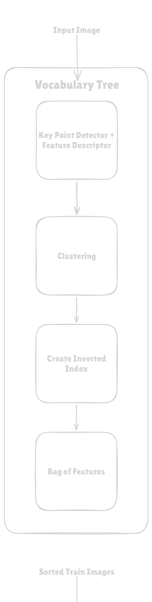
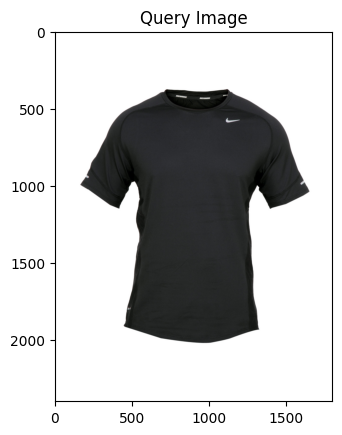
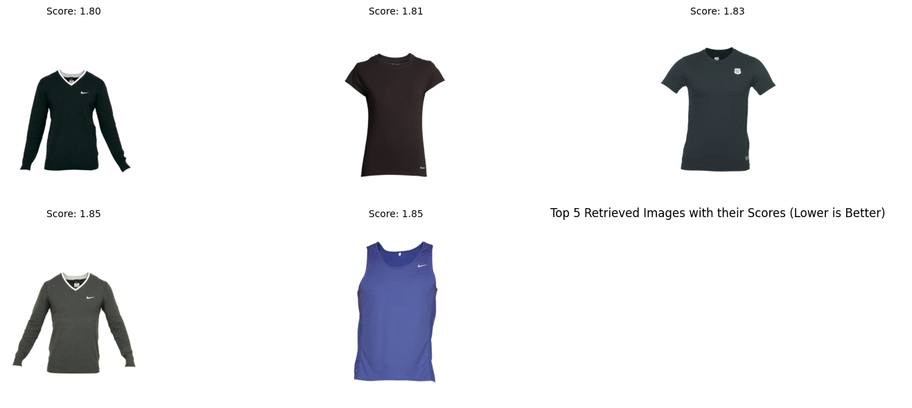

# FashionFinder

**FashionFinder** is an image search engine for clothing. You give it a photo of a garment — say, a black T-shirt — and it finds the most visually similar items from a large catalogue. No text queries, no tags, just the image itself.



---

## How It Works

At a high level, the system works in two stages:

**Building the index (offline)**
Every image in the catalogue is analysed to extract visual patterns — shapes, textures, edges, and colours. These patterns are organised into a tree-shaped index (called a *Vocabulary Tree*) that groups similar-looking patterns together. This makes searching fast even over thousands of images.

**Searching (online)**
When you provide a query image, the system extracts the same kind of visual patterns and walks them through the tree to produce a compact "fingerprint" of the image. It then compares that fingerprint against all catalogued items and returns the closest matches ranked by visual similarity.

| Query | Top Results |
|---|---|
|  |  |

---

## Features

- **Five feature descriptors** — ranging from classical computer vision (ORB, SIFT) to deep learning (ResNet-50, SuperPoint)
- **Configurable Vocabulary Tree** — tune branch factor and tree depth to trade off speed vs. accuracy
- **Color-aware search** — supports retrieval by garment type, color, or both combined
- **Evaluated rigorously** — benchmarked with MAP and nDCG metrics across 10 model configurations

---

## Descriptors Explored

| Descriptor | Description |
|---|---|
| **Baseline ORB** | Fast, rotation-invariant classical descriptor |
| **Opponent SIFT** | SIFT applied across opponent color channels for richer color sensitivity |
| **Multi-Channel ORB** | ORB run independently on each color channel and combined |
| **ORB + ResNet-50** | ORB locates keypoints; ResNet-50 deep features describe them |
| **SuperPoint** | End-to-end deep learning model for keypoint detection and description |

---

## Results

Best performing configurations (MAP = Mean Average Precision, nDCG = ranking quality):

| Model | Garment MAP | Garment nDCG | Color MAP | Combined MAP |
|---|---|---|---|---|
| Baseline ORB (B:16, H:5) | 0.660 | 0.589 | 0.471 | 0.262 |
| Multi-Channel ORB (B:32, H:6) | 0.746 | 0.668 | 0.521 | 0.345 |
| ORB + ResNet-50 (B:16, H:5) | 0.781 | 0.733 | 0.445 | 0.336 |
| **SuperPoint (B:32, H:6)** | **0.887** | **0.856** | **0.503** | **0.426** |

**SuperPoint** is the clear winner, achieving 88.7% MAP for garment-type retrieval — a significant jump over all classical approaches.

---

## Dataset

[Fashion Product Images Dataset](https://www.kaggle.com/datasets/paramaggarwal/fashion-product-images-dataset) — ~1,100 high-resolution garment images across 8 categories (T-Shirts, Jeans, Shirts, etc.) and 13 color classes.

---

## Project Structure

```
fashion-finder-cv/
├── code.ipynb          # Main notebook — full pipeline, training, evaluation, visualisation
├── metrics.csv         # Evaluation results for all 10 model configurations
├── report.pdf          # Full academic write-up
├── data.txt            # Dataset source link
├── requirements.txt    # Python dependencies
└── images/
    ├── pipeline.png    # Vocabulary tree pipeline diagram
    ├── query_img.png   # Example query image
    └── query_output.png# Example retrieval output
```

---

## Report

A detailed academic write-up covering the methodology, experiments, and analysis is available in [`report.pdf`](report.pdf).
